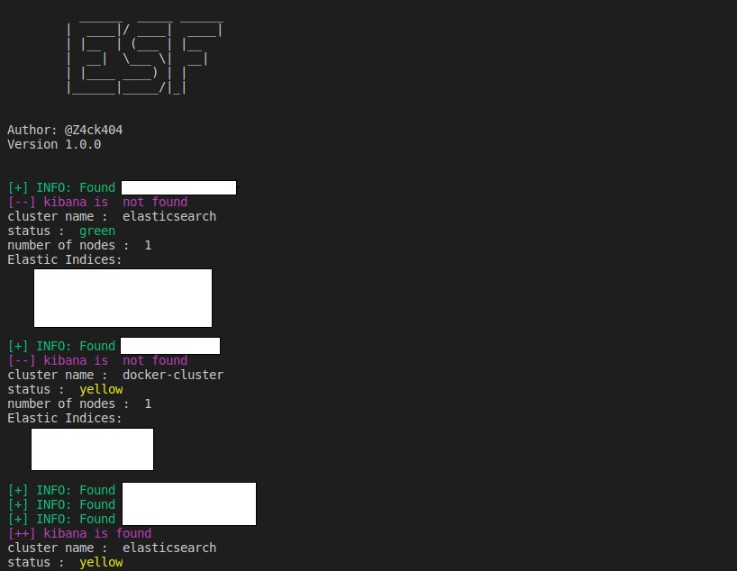

# elasticsearch-finder
A tool to find open instances of elastic search  for bug bounty

```
            ___________       ___________   ______  __________ 
           / ____/ ___/      / ____/  _/ | / / __ \/ ____/ __ 
          / __/  \__ \______/ /_   / //  |/ / / / / __/ / /_/ /
         / /___ ___/ /_____/ __/ _/ // /|  / /_/ / /___/ _, _/ 
        /_____//____/     /_/   /___/_/ |_/_____/_____/_/ |_|  

```

## Installation
Requirements:
- Python3 
- [Shodan](https://www.shodan.io/) API Key
- [BinaryEdge](https://www.binaryedge.io/) API key

Steps to install:
- Replace SHODANAPIKEY in the code with your SHODAN API KEY (line 18)
```
SHODAN_API_KEY ="SHODAN_API_HERE"
BINARYEDGE_API_KEY = "BINARYEDGE_API_KEY_HERE"
```
- Run `pip3 install -r requirements.txt` to install dependencies.
- Run `python3 esf.py -o file.txt -c US -s -b -f 1 -l 3` where : 

    - `file.txt`is the output file. (optional)
    - `US`is the code of the country you want to scan.(optional)
    - `s` use shodan to extract data
    - `b` use binaryedge to extract data  
    - `f` first page to extract data from;
    - `l` last page to extract data from

## How it works?
The script gets the data from Shodan and/or binaryedge. It will output a file (text and excel) in which you will find *open* elasticsearch instances and their meta data such as cluster name, status, number of nodes,organization based on ssl certificate if available,etc.
<p align = 'center'>
  
</p>

## Elastic search security 
- There is an open source plugin available with a free/community edition called [Search Guard](https://github.com/floragunncom/search-guard) 

## Credits 
- Inspired from [Kibanarec](https://github.com/Lekssays/kibanarec) by [Ahmed Lessays](https://github.com/Lekssays) and from [LeakLocker](https://github.com/woj-ciech/LeakLooker) by [woj-ciech](https://github.com/woj-ciech)

## TO DO 
- [ ] Do more recon on the hosts.
- [ ] Do analysis on the cluster and documents (sensitive or non sensitive data) and filter results based on that.
- [x] Add more export options (csv, excel,etc).
- [ ] Add more data ressources (Zoomeye).
- [x] Making the world more secure :) 


